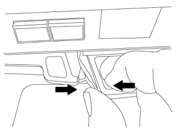

= Sostituire i moduli di sistema node1
:hardbreaks:
:allow-uri-read: 
:nofooter: 
:icons: font
:linkattrs: 
:imagesdir: ./media/

[role="lead"]
Sostituire i moduli di sistema node1 per la configurazione di aggiornamento:

* <<replace_modules,Sostituire il modulo controller AFF A220, AFF A200, AFF C190, FAS2620 o FAS2720>>
+

NOTE: È anche possibile utilizzare questa procedura per sostituire un AFF A220 configurato come ASA.

* <<Sostituire il controller AFF A700 o FAS9000 e i moduli NVRAM>>
+

NOTE: È anche possibile utilizzare questa procedura per sostituire un AFF A700 configurato come ASA.

== Sostituire il modulo controller AFF A220, AFF A200, AFF C190, FAS2620 o FAS2720

In questa fase, il node1 è inattivo e tutti i dati sono serviti dal node2. Poiché il nodo 1 e il nodo 2 si trovano nello stesso chassis e sono alimentati dallo stesso set di alimentatori, NON spegnere lo chassis. È necessario rimuovere solo il modulo controller node1. In genere, il nodo 1 è il controller A, situato sul lato sinistro dello chassis quando si guardano i controller dal retro del sistema. L'etichetta del controller si trova sul telaio, direttamente sopra il modulo controller.

.Prima di iniziare
Se non si è già collegati a terra, mettere a terra correttamente.

=== Rimuovere il modulo controller AFF A220, AFF A200, AFF C190, FAS2620 o FAS2720

Per accedere ai componenti all'interno del controller, rimuovere prima il modulo controller dal sistema, quindi rimuovere il coperchio sul modulo controller.

.Fasi
. Allentare il gancio e la fascetta che fissano i cavi al dispositivo di gestione dei cavi, quindi scollegare i cavi di sistema e gli SFP (se necessario) dal modulo controller, tenendo traccia del punto in cui sono stati collegati i cavi.
+
Lasciare i cavi nel dispositivo di gestione dei cavi in modo che quando si reinstalla il dispositivo di gestione dei cavi, i cavi siano organizzati.

. Rimuovere e mettere da parte i dispositivi di gestione dei cavi dai lati sinistro e destro del modulo controller.
+
image::../media/drw_25xx_cable_management_arm.png[ARM di gestione dei cavi drw 25xx]

. Premere il dispositivo di chiusura sulla maniglia della camma fino al rilascio, aprire completamente la maniglia della camma per rilasciare il modulo controller dalla scheda intermedia, quindi estrarre il modulo controller dallo chassis con due mani.
+

. Capovolgere il modulo controller e posizionarlo su una superficie piana e stabile.

=== Installare il modulo controller ASA A150, AFF A150 o FAS2820

Utilizzare la seguente procedura per installare il modulo controller ASA A150, AFF A150 o FAS2820 in node1.

.Fasi
. Allineare l'estremità del modulo controller con l'apertura dello chassis, quindi spingere delicatamente il modulo controller a metà nel sistema.
+

NOTE: Non inserire completamente il modulo controller nel telaio fino a quando non viene richiesto di farlo più avanti nella procedura.

. Collegare le porte di gestione e console al modulo controller node1.
+

NOTE: Poiché lo chassis è già acceso, node1 avvia l'inizializzazione del BIOS seguita da autoboot non appena è completamente inserito. Per interrompere l'avvio node1, prima di inserire completamente il modulo controller nello slot, si consiglia di collegare la console seriale e i cavi di gestione al modulo controller node1.

. Con la maniglia della camma in posizione aperta, spingere con decisione il modulo controller fino a quando non raggiunge la scheda intermedia e non è completamente inserito. Il dispositivo di chiusura si solleva quando il modulo controller è completamente inserito. Chiudere la maniglia della camma in posizione di blocco.
+

NOTE: Per evitare di danneggiare i connettori, non esercitare una forza eccessiva quando si fa scorrere il modulo controller nel telaio.

. Collegare la console seriale non appena il modulo è inserito ed essere pronti per interrompere L'AUTOBOOT del node1.
. Dopo aver interrotto L'AUTOBOOT, node1 si ferma al prompt DEL CARICATORE. Se non si interrompe L'AVVIO AUTOMATICO in tempo e node1 inizia l'avvio, attendere il prompt e premere *Ctrl-C* per accedere al menu di avvio. Dopo che il nodo si è arrestato nel menu di boot, usare l'opzione 8 per riavviare il nodo e interrompere L'AUTOBOOT durante il riavvio.
. Al prompt LOADER> di node1, impostare le variabili di ambiente predefinite:
+
`set-defaults`

. Salvare le impostazioni predefinite delle variabili di ambiente:
+
`saveenv`

== Sostituire il controller AFF A700 o FAS9000 e i moduli NVRAM

In questa fase, il node1 è inattivo e tutti i dati sono serviti dal node2. Poiché il nodo 1 e il nodo 2 si trovano nello stesso chassis e sono alimentati dallo stesso set di alimentatori, NON spegnere lo chassis. Rimuovere solo il modulo controller node1 e il modulo NVRAM node1. In genere, il nodo 1 è il controller A, situato sul lato sinistro dello chassis quando si guardano i controller dal retro del sistema. L'etichetta del controller si trova sul telaio, direttamente sopra il modulo controller.

.Prima di iniziare
Se non si è già collegati a terra, mettere a terra correttamente.

=== Rimuovere il modulo del controller AFF A700 o FAS9000

Utilizzare la seguente procedura per rimuovere il modulo controller AFF A700 o FAS9000.

.Fasi
. Scollegare il cavo della console, se presente, e il cavo di gestione dal modulo controller node1 prima di rimuovere il modulo controller dal node1.
+

WARNING: Quando si lavora sul node1, rimuovere solo i cavi console e e0M dal node1. Durante questa procedura, non rimuovere o sostituire altri cavi o collegamenti sul nodo 1 o sul nodo 2.

. Sbloccare e rimuovere il modulo controller A dal telaio.
+
.. Far scorrere il pulsante arancione sulla maniglia della camma verso il basso fino a sbloccarla.
+
image::../media/drw_9500_remove_PCM.png[Rimuovere il modulo controller]

+
[cols="20,80"]
|===

 a| 
image::../media/black_circle_one.png[Numero uno]
| Pulsante di rilascio della maniglia della camma 

 a| 
image::../media/black_circle_two.png[Numero due]
| Maniglia CAM 
|===
.. Ruotare la maniglia della camma in modo da disimpegnare completamente il modulo controller dal telaio, quindi estrarre il modulo controller dal telaio.
+
Assicurarsi di sostenere la parte inferiore del modulo controller mentre lo si sposta fuori dallo chassis.

=== Rimuovere il modulo NVRAM AFF A700 o FAS9000

Utilizzare la seguente procedura per rimuovere il modulo NVRAM AFF A700 o FAS9000.

NOTE: Il modulo NVRAM AFF A700 o FAS9000 si trova nello slot 6 e ha un'altezza doppia rispetto agli altri moduli del sistema.

.Fasi
. Sbloccare e rimuovere il modulo NVRAM dallo slot 6 del nodo 1.
+
.. Premere il tasto contrassegnato e numerato CAM.
+
Il pulsante CAM si allontana dal telaio.

.. Ruotare il fermo della camma verso il basso fino a portarlo in posizione orizzontale.
+
Il modulo NVRAM si disinnesta dal telaio e si sposta di alcuni centimetri.

.. Rimuovere il modulo NVRAM dallo chassis tirando le linguette di estrazione sui lati del lato anteriore del modulo.
+
image::../media/drw_a900_move-remove_NVRAM_module.png[Rimuovere il modulo NVRAM]

+
[cols="20,80"]
|===

 a| 
image::../media/black_circle_one.png[Numero uno]
| Latch i/o Cam intestato e numerato 

 a| 
image::../media/black_circle_two.png[Numero due]
| Fermo i/o completamente sbloccato 
|===

=== Installare ASA A900, AFF A900 o FAS9500 NVRAM e moduli controller

Installare la NVRAM ASA A900, AFF A900 o FAS9500 e i moduli controller ricevuti per l'aggiornamento su node1.

Quando si esegue l'installazione, tenere presente quanto segue:

* Spostare tutti i moduli di riempimento vuoti negli slot 6-1 e 6-2 dal vecchio modulo NVRAM al nuovo modulo NVRAM.
* NON spostare il dispositivo di scarico dal modulo NVRAM AFF A700 al modulo NVRAM ASA A900 o AFF A900.
* Spostare tutti i moduli flash cache installati nel modulo NVRAM FAS9000 nel modulo NVRAM FAS9500.

.Prima di iniziare
Se non si è già collegati a terra, mettere a terra correttamente.

==== Installare il modulo NVRAM ASA A900, AFF A900 o FAS9500

Utilizzare la seguente procedura per installare il modulo NVRAM ASA A900, AFF A900 o FAS9500 nello slot 6 di node1.

.Fasi
. Allineare il modulo NVRAM ai bordi dell'apertura dello chassis nello slot 6.
. Far scorrere delicatamente il modulo NVRAM nello slot fino a quando il dispositivo di chiusura della camma i/o con lettere e numeri inizia a innestarsi nel perno della camma i/o, quindi spingere il dispositivo di chiusura della camma i/o fino in fondo per bloccare il modulo NVRAM in posizione.
+
image::../media/drw_a900_move-remove_NVRAM_module.png[Installare il modulo NVRAM]

+
[cols="20,80"]
|===

 a| 
image::../media/black_circle_one.png[Numero uno]
| Latch i/o Cam intestato e numerato 

 a| 
image::../media/black_circle_two.png[Numero due]
| Fermo i/o completamente sbloccato 
|===

==== Installare il modulo controller ASA A900, AFF A900 o FAS9500 su node1.

Utilizzare la seguente procedura per installare il modulo controller ASA A900, AFA A900 o FAS9500 in node1.

.Fasi
. Allineare l'estremità del modulo controller con l'apertura A nel telaio, quindi spingere delicatamente il modulo controller a metà corsa nel sistema.
+

NOTE: Non inserire completamente il modulo controller nel telaio fino a quando non viene richiesto di farlo più avanti nella procedura.

. Collegare le porte di gestione e console al modulo controller node1.
+

NOTE: Poiché lo chassis è già acceso, node1 avvia l'inizializzazione del BIOS seguita da autoboot non appena è completamente inserito. Per interrompere l'avvio node1, prima di inserire completamente il modulo controller nello slot, si consiglia di collegare la console seriale e i cavi di gestione al modulo controller node1.

. Spingere con decisione il modulo controller nello chassis fino a quando non raggiunge la scheda intermedia e non è completamente inserito.
+
Il dispositivo di chiusura si solleva quando il modulo controller è completamente inserito.

+

WARNING: Per evitare di danneggiare i connettori, non esercitare una forza eccessiva quando si fa scorrere il modulo controller nel telaio.

+
image::../media/drw_9500_remove_PCM.png[Installare il modulo controller]

+
[cols="20,80"]
|===

 a| 
image::../media/black_circle_one.png[Numero uno]
| Fermo di bloccaggio della maniglia della camma 

 a| 
image::../media/black_circle_two.png[Numero due]
| Maniglia della camma in posizione sbloccata 
|===
. Collegare la console seriale non appena il modulo è inserito ed essere pronti per interrompere L'AUTOBOOT del node1.
. Dopo aver interrotto L'AUTOBOOT, node1 si ferma al prompt DEL CARICATORE. Se non si interrompe L'AVVIO AUTOMATICO in tempo e node1 inizia l'avvio, attendere il prompt e premere *Ctrl-C* per accedere al menu di avvio. Dopo che il nodo si è arrestato nel menu di boot, utilizzare l'opzione `8` Per riavviare il nodo e interrompere L'AVVIO AUTOMATICO durante il riavvio.
. Al prompt LOADER> di node1, impostare le variabili di ambiente predefinite:
+
`set-defaults`

. Salvare le impostazioni predefinite delle variabili di ambiente:
+
`saveenv`

