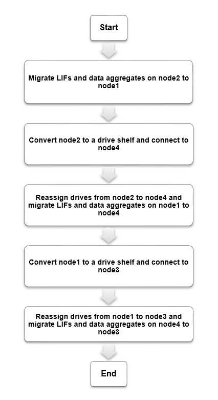

= Workflow
:allow-uri-read: 
:icons: font
:imagesdir: ../media/

[role="lead"]
È possibile eseguire un upgrade senza interruzioni da un sistema NetApp AFF A250 a un sistema AFF A400 convertendo ciascun nodo AFF A250 in uno shelf di dischi NS224 e quindi collegandosi ai nodi sostitutivi AFF A400.

In questa procedura, i controller di coppia ad alta disponibilità (ha) AFF A250 sono chiamati node1 e node2, mentre i controller di coppia ha A400 AFF sostitutivi sono chiamati node3 e node4.

.Fasi.
. xref:upgrade_migrate_lifs_aggregates_node2_to_node1.adoc[Migrazione di LIF e aggregati di dati dal nodo 2 al nodo 1]
. xref:upgrade_convert_node2_drive_shelf_connect_node4.adoc[Convertire il nodo 2 in uno shelf di dischi e connettersi al nodo 4]
. xref:upgrade_reassign_drives_node2_to_node4.adoc[Riassegnare i dischi dal nodo 2 al nodo 4]
. xref:upgrade_migrate_aggregates_epsilon_lifs_node1_node4.adoc[Migrazione di aggregati di dati, epsilon e LIF dal nodo 1 al node4]
. xref:upgrade_convert_node1_drive_shelf_connect_node3.html[Converti il node1 in uno shelf di dischi e connettiti al node3]
. xref:upgrade_reassign_drives_node1_to_node3.adoc[Riassegnare i dischi dal nodo 1 al nodo 3]
. xref:upgrade_migrate_lIFs_aggregates_node4_node3.adoc[Migrazione di LIF e aggregati di dati dal nodo 4 al node3]

