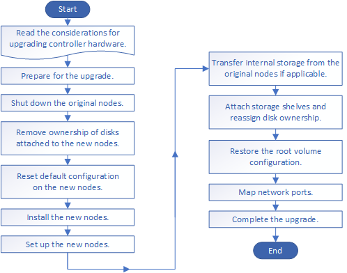

= Workflow
:allow-uri-read: 
:icons: font
:imagesdir: ../media/

[role="lead"]
Se si sta aggiornando l'hardware del controller spostando lo storage, si preparano i nodi originali e si configurano i nuovi nodi. Alcuni modelli di piattaforma supportano il trasferimento dello storage interno ai nuovi nodi. Riassegnare i dischi e ripristinare la configurazione del volume root nei nuovi nodi e configurare le porte di rete. L'aggiornamento tramite lo spostamento dello storage è una procedura di interruzione.

[NOTE]
====
Nei passaggi per l'aggiornamento dell'hardware del controller mediante lo spostamento dello storage, i nodi originali sono chiamati node1 e node2, mentre i nuovi nodi sono chiamati node3 e node4. Durante la procedura descritta, il node1 viene sostituito dal node3, mentre il node2 viene sostituito dal node4.

image::../upgrade/media/original_to_new_nodes.png[da originale a nuovi nodi]

I termini node1, node2, node3 e node4 vengono utilizzati solo per distinguere tra i nodi originali e quelli nuovi. Quando si segue la procedura, è necessario sostituirli con i nomi reali dei nodi originali e nuovi. Tuttavia, in realtà, i nomi dei nodi non cambiano: Node3 ha il nome node1 e node4 ha il nome node2 dopo l'aggiornamento dell'hardware del controller.

====
.Fasi
. xref:upgrade-prepare-when-moving-storage.adoc[Preparatevi per l'aggiornamento durante lo spostamento dello storage]
. xref:upgrade-shutdown-remove-original-nodes.adoc[Chiudere i nodi originali]
. xref:upgrade-remove-disk-ownership-new-nodes.adoc[Rimuovere la proprietà dei dischi collegati ai nuovi nodi]
. xref:upgrade-reset-default-configuration-node3-and-node4.adoc[Ripristinare la configurazione predefinita sui nuovi nodi]
. xref:upgrade-install-new-nodes.adoc[Installare i nuovi nodi]
. xref:upgrade-set-up-new-nodes.adoc[Impostare i nuovi nodi]
. xref:upgrade-optional-move-internal-storage.adoc[Opzionale: Spostare lo storage interno o convertire il sistema in uno shelf di dischi]
. xref:upgrade-attach-shelves-reassign-disks.adoc[Collegare shelf di storage e riassegnare la proprietà del disco]
. xref:upgrade-restore-root-volume-config.adoc[Ripristinare la configurazione del volume root]
. xref:upgrade-complete.adoc[Completare l'aggiornamento]

.Informazioni correlate
* xref:upgrade_aff_a250_to_aff_a400_ndu_upgrade_workflow.adoc[Aggiorna AFF A250 a AFF A400 convertendo in uno shelf di dischi] (procedura senza interruzioni).

